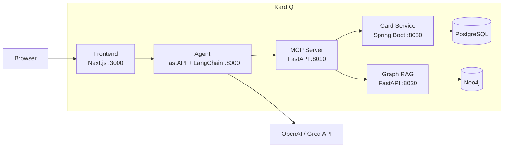

# Architecture Diagram

High-level component view. Every arrow is an HTTP call; there is no direct
cross-service database access.

- The browser only ever calls the agent.
- The agent only ever calls the MCP server (plus the LLM provider directly).
- The MCP server is the only caller of card-service and graph-rag.
- PostgreSQL is reachable only from card-service; Neo4j only from graph-rag.
