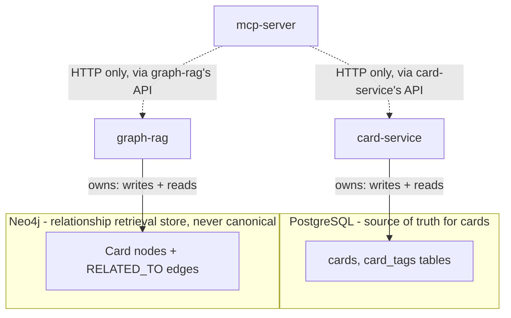

# Data Ownership Diagram

Each datastore has exactly one owning service. No other component reads
or writes it directly.

- **PostgreSQL** is owned exclusively by `card-service`. A card's title,
  body, tags, and timestamps live here and nowhere else.
- **Neo4j** is owned exclusively by `graph-rag`. It mirrors a card's
  `id`/`title`/`body`/`tags`/`updatedAt` as node properties (kept in sync
  via `scripts/seed-data.sh` or an equivalent sync call) plus the
  `RELATED_TO` relationships between cards - it is a retrieval index, not
  a second source of truth.
- Every other component reaches card data or graph data only through
  card-service's or graph-rag's HTTP API, via the MCP server.
