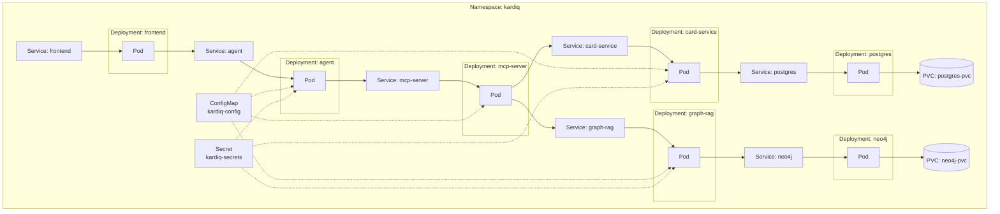

# Kubernetes Deployment Diagram

Everything lives in the `kardiq` namespace, one Pod per component (all
`replicas: 1`), matching `infra/k8s/`.

Every Deployment sets `enableServiceLinks: false` - without it, Kubernetes
auto-injects `<SERVICE>_PORT`-style environment variables for every
Service in the namespace, which collided with (and corrupted) Neo4j's own
`NEO4J_`-prefixed config-from-env mechanism during testing. `card-service`,
`graph-rag`, `mcp-server`, and `agent` read `kardiq-config`/`kardiq-secrets`
via `envFrom`; `postgres` and `neo4j` map only the specific keys they need.
`frontend` needs neither at runtime - its agent URL is baked in at image
build time.
