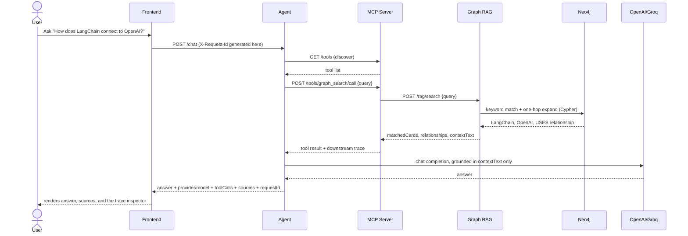

# Sequence Diagram: Asking a Question

The exact worked example from the root `CLAUDE.md`: "How does LangChain
connect to OpenAI?", assuming the demo cards and relationship are already
seeded.

If `graph_search` returns no context, the agent skips the LLM call
entirely and returns a fixed "not enough context" answer instead of
guessing from the model's own training data.
